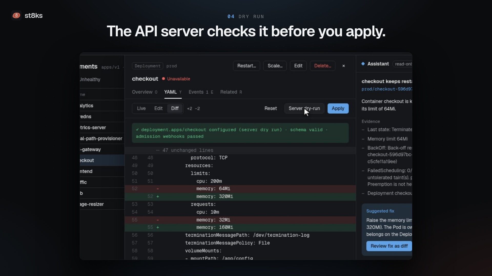
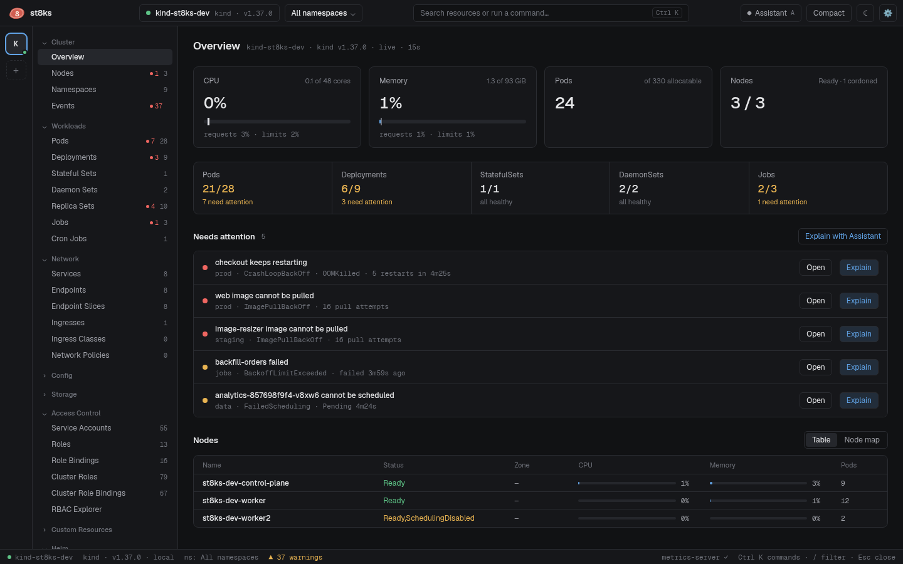
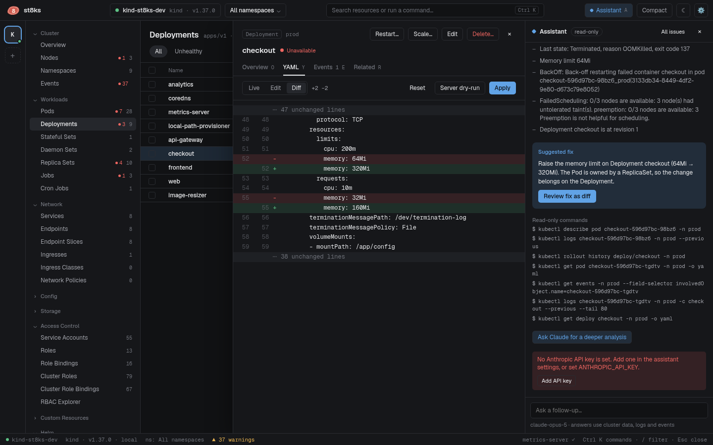

<div align="center">
  
  <h1>st8ks</h1>
  <p><b>A fast Kubernetes desktop client that finds what is broken and helps you fix it.</b></p>
  <p>Linux · macOS · Windows</p>
  <p>
    <a href="../../releases/latest">Download</a> ·
    <a href="docs/README.md">Documentation</a> ·
    <a href="docs/development.md">Develop</a> ·
    <a href="docs/releasing.md">Release process</a>
  </p>
</div>

[](../../releases/latest)

st8ks watches your clusters live. It shows every resource, finds workloads that fail, collects the evidence, and proposes a fix that you review as a diff. Every change goes through a confirmation with an optional server dry run.



## What you can do

| | |
| --- | --- |
| **See every resource live** | Lists for all built-in kinds and every CRD. Filter with `ns:prod status:crash app=web`, sort, save views, and act on many objects at once. [More](docs/resources.md) |
| **Find what is broken** | st8ks detects crash loops, OOM kills, missing images, pods that cannot be scheduled, stuck rollouts and failed jobs. [More](docs/issues-and-assistant.md) |
| **Fix it safely** | Review a proposed fix as a YAML diff, run a server dry run, then apply. Protected namespaces need the name typed first. [More](docs/editing.md) |
| **Edit manifests in Git** | The IDE checks your manifests against the schema and the live pods of the cluster, shows the diff to the cluster, applies with server-side apply, and commits and pushes. [More](docs/ide.md) |
| **Debug a container** | Stream logs, open a shell, attach a debug container to a pod that crashes, and forward ports. [More](docs/logs-shell-port-forward.md) |
| **Understand access** | The RBAC explorer names the binding and the rule behind each permission. The API server confirms each answer. [More](docs/rbac.md) |
| **Operate Helm releases** | Revision history, rollback, uninstall, and upgrade with edited values. [More](docs/helm.md) |
| **Trace traffic** | A topology graph from ingress to service, pod, ReplicaSet and Deployment. [More](docs/topology.md) |
| **Ask why** | The read-only assistant explains an issue from the YAML, events and logs with the Claude API. [More](docs/issues-and-assistant.md#assistant) |



## Install

Download the file for your platform from the [latest release](../../releases/latest):

| Platform | File |
| --- | --- |
| macOS, Apple silicon and Intel | `st8ks-darwin-universal.dmg` |
| Windows x64 or Arm | `st8ks-windows-amd64-setup.exe` or `st8ks-windows-arm64-setup.exe` |
| Linux x86-64 or Arm64 | `st8ks-linux-amd64.tar.gz` or `st8ks-linux-arm64.tar.gz` |

On Linux, extract the archive and run `./install.sh`. st8ks needs WebKitGTK 4.1 and GTK 3. The [installation guide](docs/installation.md) covers each platform, Gatekeeper and SmartScreen prompts, and checksums.

## Quick start

st8ks reads the same kubeconfig files as kubectl. Start it, and it opens your current context.

```sh
st8ks                                   # KUBECONFIG, ~/.kube/config and other files in ~/.kube
st8ks --kubeconfig ~/clusters/lab.yaml  # only this file
st8ks --context prod-eu                 # open this context first
```

Press `Ctrl K`, or `⌘K` on macOS, to search resources and run commands. The [getting started guide](docs/getting-started.md) takes five minutes.

## Try it on a local cluster

You need Docker. The script downloads `kind` and `helm` when they are missing:

```sh
make cluster-up      # a 3-node kind cluster with workloads that fail on purpose
make dev             # st8ks finds ~/.kube/st8ks-dev.yaml by itself
make cluster-reset   # delete the cluster and create it again
make cluster-down    # delete the cluster
```

See [Development](docs/development.md#local-cluster) for what the cluster contains.

## Documentation

- [Installation](docs/installation.md)
- [Getting started](docs/getting-started.md)
- [Clusters and kubeconfig files](docs/kubeconfig.md)
- [Resources, filters and bulk actions](docs/resources.md)
- [Details, YAML editing and safe changes](docs/editing.md)
- [IDE for manifests in Git](docs/ide.md)
- [Logs, shells and port-forwards](docs/logs-shell-port-forward.md)
- [Issues and the assistant](docs/issues-and-assistant.md)
- [RBAC explorer](docs/rbac.md)
- [Helm releases](docs/helm.md)
- [Topology](docs/topology.md)
- [Keyboard shortcuts](docs/keyboard.md)
- [Settings, flags and environment variables](docs/configuration.md)
- [Troubleshooting](docs/troubleshooting.md)
- [Architecture and performance](docs/architecture.md)
- [Development](docs/development.md)
- [Release process](docs/releasing.md)

## Build from source

```sh
go install github.com/wailsapp/wails/v2/cmd/wails@v2.16.0
make build    # the binary goes to build/bin
```

On Linux, install `libgtk-3-dev` and `libwebkit2gtk-4.1-dev` first. [Development](docs/development.md) lists the requirements for each platform.
