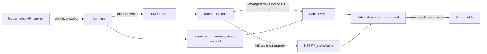

# Architecture and performance

st8ks is a [Wails v2](https://wails.io) app. A Go backend talks to Kubernetes with client-go and the Helm SDK. A React and TypeScript frontend renders in the webview of the platform: WebKitGTK on Linux, WKWebView on macOS and WebView2 on Windows.

The main goal of the design is speed with large clusters. The frontend must stay at 60 frames per second while thousands of objects change.

## Data flow

1. **Informers** watch each kind. Built-in kinds use typed clients with protobuf, which decode several times faster than JSON. Custom resources use the dynamic client.
2. A **transform** removes `managedFields` and the last-applied annotation before an object enters the cache. For Secrets it removes the values, and for ConfigMaps the data.
3. A **row builder** turns each object into a compact row: the name, namespace, creation time, display cells, one tone letter per cell, and a flag for "needs attention". The builders follow the logic of `kubectl get`, for example for the pod status.
4. A **table** for each kind stores the rows. It skips a row that did not change, so a status update that changes no visible column costs nothing more. It keeps counts per namespace up to date on each change.
5. Every **100 ms**, a flush loop sends the rows that changed, as one event per kind, but only for the kinds that the frontend watches. Counts go out every 400 ms.
6. The frontend loads a **full table** over the Wails asset server as a plain HTTP response. The webview parses the JSON body directly, which is faster than an event for large tables.
7. The **table stores** in the frontend change their `Map` in place and notify React once per animation frame at most.

A version number on each table keeps the snapshot and the deltas consistent. The frontend drops a delta that is older than its snapshot, and it queues deltas that arrive while a snapshot loads.

## What the frontend renders

- **Virtual lists.** Rows have a fixed height, so the visible range comes from the scroll offset without measurement. The list renders the visible rows and one screen of rows above and below them, about 80 rows in a full window. The list renders in the same frame as the scroll event, so a fast scroll shows no empty space.
- **Memoized rows.** A row renders again only when its object, its metrics or its selection changes.
- **CSS classes, not inline styles,** for everything that repeats.
- **Fast filter and sort.** The filter text of each row and the natural sort keys are cached per row object. Row objects never change, so the cache stays valid. The default sort compares plain strings, not a collator.
- **Lazy code.** CodeMirror and xterm.js load on first use. The first load of the app is about 100 KB of compressed JavaScript.
- **Logs** keep the newest 100,000 lines. The filter processes only the lines that are new since the last frame.

## Measured

These numbers come from 6,019 ConfigMaps in one list, in Chromium on Linux:

| Operation | Result |
| --- | --- |
| Open the list, including the switch from a metadata watch to a full watch | 226 ms |
| Filter keystroke to paint | 1 to 2 frames |
| Sort by a column | 37 ms |
| Scroll | 60 fps, 95th percentile frame 17.1 ms |
| All 6,000 objects change at once | No long task, 95th percentile frame 16.9 ms |
| Connect and load all pods of a three-node cluster | 330 ms |

To repeat the measurement, run `make cluster-up` and `hack/dev-cluster/load.sh 6000`, then open **Config > Config Maps**.

## Watches

| Kinds | Watch |
| --- | --- |
| Every built-in kind except ConfigMaps and Secrets | A full watch from the moment st8ks connects, for the counts, issues, relations and topology |
| ConfigMaps, Secrets | Metadata only, for the counts. A full watch starts when you open the list. |
| Custom resources | A full watch when you open the list. Certificates of cert-manager start at once, for the overview. |

All watches share one HTTP/2 connection to the API server. When the credentials cannot list a kind in all namespaces, st8ks watches the namespace of the context instead.

## Connection health

A health loop asks the API server for `/version` every 10 seconds. After a failure, it asks again after 2 seconds. Two failures in a row mark the cluster as unreachable. The frontend then hides the cached data. A watch error also triggers a check. When the server answers again, the informers resume on their own.

## Issues and fixes

A loop runs once per second when a relevant table changed. It checks pods, nodes, workloads, jobs, claims and certificates, and groups pods of the same workload into one issue. A fix is a proposal, never a change: a YAML draft for the diff view, or a confirmation dialog.

## Assistant

The assistant builds a text context from the issue, the object YAML, events and previous logs. It streams the answer from the Claude API with a read-only system prompt. The context is cached per cluster and issue, so follow-up questions do not read the cluster again.

## IDE

The IDE backend is the package `internal/ide`. It does not import the Kubernetes packages of st8ks. It reads the cluster through the `ide.Cluster` interface, which `internal/kube/ide.go` implements on the connected cluster.

- **Checks** run in one background loop. The loop wakes 120 ms after an edit, and every 2 seconds while the IDE shows. It parses only the files whose text changed, and it runs the checks of a file again only when its text, the facts that other files give it, the schema or the build result change. The live checks read the watch cache, so they cost no API calls. The frontend gets only the files whose diagnostics changed.
- **Schemas** come from the OpenAPI v3 endpoint of the cluster, one group version at a time, when a file first needs one.
- **Kustomize** runs in process with the kustomize library. Unsaved editor buffers replace the files on disk during a build. A kustomization builds again only when one of its files changes.
- **Git** runs as the `git` command, so your configuration, hooks and credentials apply.
- **The terminal** runs your shell in a pseudo-terminal. Its output goes to the frontend in batches of 16 ms, like a pod shell.
- **The editor** keeps one CodeMirror state for each tab in one editor view. A keystroke renders only the editor and the parts that show the dirty flag.

The IDE code and CodeMirror load when the IDE opens first.

## Kubeconfig loading

The primary kubeconfig loads as one merged config, like kubectl. Every extra file loads on its own, so contexts with the same name in different files stay apart. A watcher compares the modification time and size of every source and the file list of every watched folder every 3 seconds.

## Project layout

| Path | Contents |
| --- | --- |
| `main.go`, `app.go`, `app_ide.go` | Startup, flags, and the methods that the frontend calls |
| `internal/kube/cluster.go` | Connection, discovery, informers, the flush loop and the health loop |
| `internal/kube/kinds.go`, `crd.go` | The kind registry and the row builders |
| `internal/kube/table.go` | Tables, deltas and counts |
| `internal/kube/manager.go`, `kubeconfig.go` | Contexts, kubeconfig sources, sessions and port-forwards |
| `internal/kube/object.go` | Object detail, relations and all changes |
| `internal/kube/issues.go`, `metrics.go`, `aicontext.go` | Issue detection, metrics and the assistant context |
| `internal/kube/logs.go`, `exec.go`, `portforward.go` | Streams |
| `internal/kube/rbac.go`, `helm.go`, `topology.go` | The RBAC explorer, Helm and the topology |
| `internal/ide` | The IDE: workspace, Git, checks, schemas, kustomize, live diff, apply and the terminal |
| `internal/kube/ide.go` | The cluster access of the IDE: live objects, pod facts, server-side apply and rollout status |
| `internal/assistant` | The Claude API client |
| `internal/settings`, `internal/shellenv` | Settings and the login shell environment |
| `frontend/src/lib` | The bridge to Go, stores, tables, filters and streams |
| `frontend/src/components` | The views |
| `frontend/src/components/ide`, `frontend/src/lib/ide.ts` | The IDE views and their state |
| `build/` | Icons, platform manifests and the Windows installer script |
| `scripts/package.sh` | Release packaging |
| `hack/dev-cluster` | The local test cluster |
