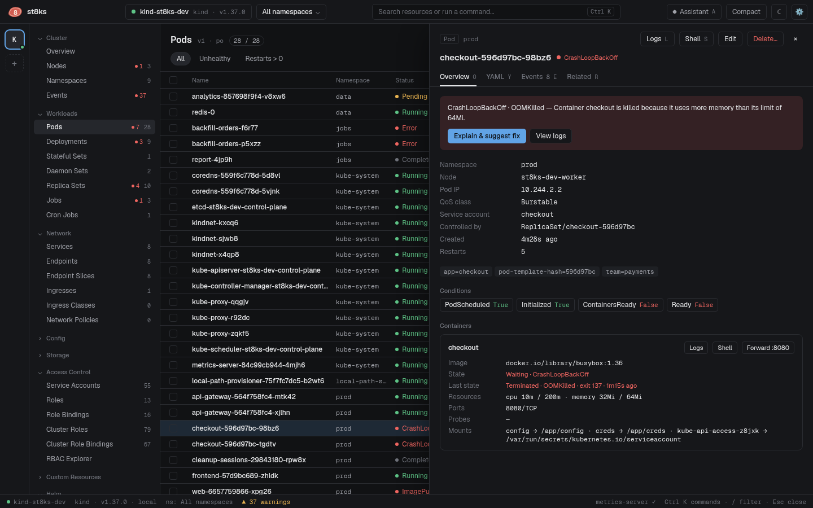

# Getting started

This guide takes about five minutes. You need a cluster and a kubeconfig file that works with kubectl. If you have no cluster, run `make cluster-up` in the repository to create a local one. See [Development](development.md#local-cluster).

## 1. Start st8ks

Start st8ks from your app launcher, or from a terminal:

```sh
st8ks
```

st8ks opens the context you used last. On the first start, it opens the `current-context` of your kubeconfig file. The context switcher in the top bar shows the context, the distribution and the Kubernetes version.

The rail on the left has one button for each context. A green dot means that the API server answers. A red dot means that it does not answer. Click a button to switch context.

## 2. Read the overview


The overview shows:

- **CPU and memory**: use against the allocatable capacity, with markers for requests and limits. The bars need metrics-server in the cluster.
- **Workload health**: how many pods, deployments, stateful sets, daemon sets and jobs are healthy. Click a tile to list the objects that need attention.
- **Needs attention**: the issues that st8ks detects. Click **Explain** to see the evidence and a proposed fix.
- **Nodes**: a table, or a map with one square for each pod. Switch with **Table** and **Node map**.

## 3. Find a resource

The tree on the left lists every kind that the cluster serves. The number shows how many objects exist. A red dot shows how many need attention.

To find an object anywhere, press `Ctrl K`, or `⌘K` on macOS, and type part of its name. The same palette opens logs and shells and switches contexts.

To narrow a list, press `/` and type a filter:

```text
ns:prod status:crash
app=checkout
-kube-system
```

[Resources, filters and bulk actions](resources.md) explains the filter syntax.

## 4. Open an object

Click a row. The detail panel opens with four tabs: **Overview**, **YAML**, **Events** and **Related**. For a pod, the overview shows each container with its state, resources, probes and mounts.



Buttons at the top act on the object: **Logs**, **Shell**, **Restart…**, **Scale…**, **Edit** and **Delete…**. The buttons depend on the kind.

## 5. Fix an issue

1. On the overview, click **Explain** next to an issue.
2. Read the evidence and the suggested fix in the assistant panel.
3. Click the action, for example **Review fix as diff**.
4. Review the diff. Click **Server dry-run** to let the API server validate it.
5. Click **Apply**.

st8ks watches the object after the change. The issue goes away when the workload recovers.

## Next steps

- [Clusters and kubeconfig files](kubeconfig.md): add files and folders, and use flags.
- [Keyboard shortcuts](keyboard.md): work faster.
- [Settings](configuration.md): add an Anthropic API key for the assistant.
