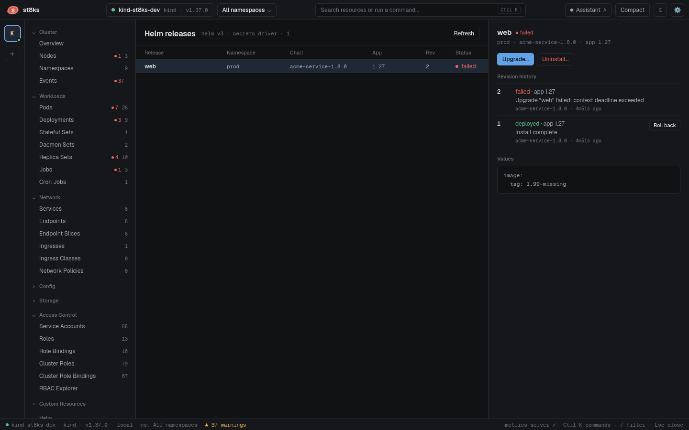

# Helm releases

Open **Helm > Releases** to see every Helm 3 release in the selected namespaces. The list refreshes every 10 seconds.

## Release details

Click a release. The side panel shows:

- The status, the chart and the app version.
- The revision history with the status and description of each revision.
- The user-supplied values of the current revision, like `helm get values`.
- The release notes of the chart.

## Roll back

1. Click **Roll back** next to a revision.
2. Check **Dry run first** to render the revision without a change, or leave it clear.
3. Click **Roll back**.

A rollback creates a new revision from the old one. Chart hooks run. This is the same as `helm rollback RELEASE REVISION`.

## Upgrade with new values

1. Click **Upgrade…**. An editor opens with the current user-supplied values.
2. Change the values.
3. Click **Dry run** to render the chart with the new values.
4. Click **Upgrade**.

The upgrade uses the chart that the release already stores, so no chart repository is needed. The new values replace the old user-supplied values, like `helm upgrade --reset-values -f values.yaml`. To change the chart version, use the Helm CLI.

## Uninstall

Click **Uninstall…** and type the release name to confirm. st8ks deletes every resource of the release, except resources with the `helm.sh/resource-policy: keep` annotation.

## Repositories

**Helm > Repositories** lists the chart repositories from your local Helm configuration, the same list as `helm repo list`.

## How st8ks reads releases

Helm stores each revision in a Secret with the label `owner=helm`. To be fast, st8ks lists only the Secrets that are not superseded and decodes the newest revision of each release. The detail panel decodes the full history of one release. Rollback, uninstall and upgrade use the Helm SDK.

st8ks reads releases that the `secret` storage driver stores. This is the Helm default.
