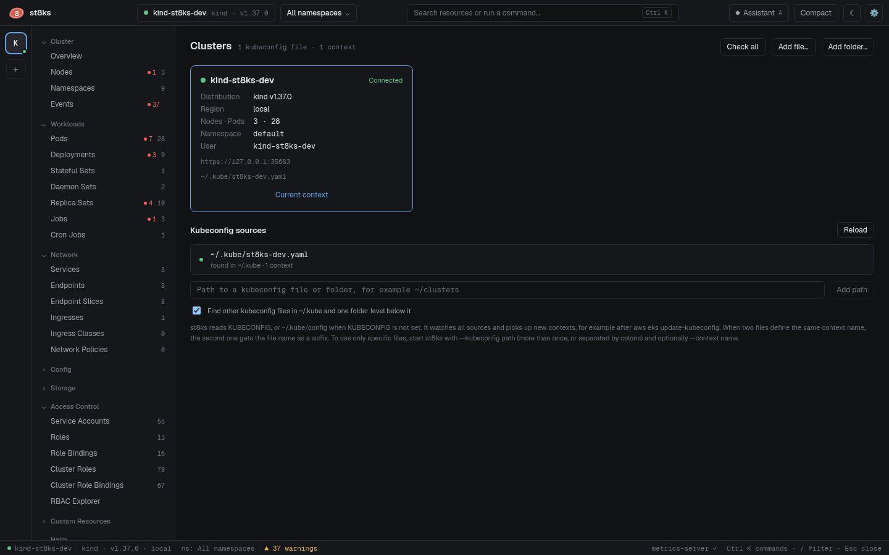

# Clusters and kubeconfig files

st8ks reads the same kubeconfig files as kubectl. It also finds other kubeconfig files on your machine, and it can use only the files that you give it.



## Where st8ks looks

st8ks reads these sources, in this order:

1. **The primary kubeconfig.** This is the list of files in `KUBECONFIG`. When `KUBECONFIG` is not set, it is `~/.kube/config`. st8ks merges these files the same way as kubectl. A context in one file can use a user or a cluster from another file in the list.
2. **Files and folders that you add.** Add them in the Clusters view, or in the command palette. For a folder, st8ks reads every kubeconfig file in the folder and one level below it.
3. **Other files in `~/.kube`.** st8ks reads every kubeconfig file in `~/.kube` and one level below it. It skips `cache`, `http-cache` and other tool folders. You can turn off this scan in the Clusters view.

A file counts as a kubeconfig file when it contains `clusters` and `contexts`. Files larger than 4 MB are skipped.

## Add a file or a folder

1. Click **Clusters** in the tree, or the **+** button in the rail.
2. Click **Add file…** or **Add folder…**. You can also type a path and click **Add path**.

st8ks stores the paths in its [settings](configuration.md).

## Remove a file or a folder

To stop reading a source, click **Remove** next to it in **Kubeconfig sources**. No file is deleted.

- An added file or folder leaves the list.
- A file that st8ks found itself stays in the list, crossed out. This applies to `~/.kube/config`, a file in `KUBECONFIG`, a file in an added folder and a file from the `~/.kube` scan. To read it again, click **Add back**.

You cannot remove the source of the connected context. Switch to another context first. Files from `--kubeconfig` cannot be removed in the app.

## Delete a context

To delete a context from its kubeconfig file, click **Delete…** on its card in the Clusters view, then confirm. st8ks does the same as `kubectl config delete-context`:

- It removes the context from the file that defines it. The card shows the file.
- It keeps the cluster and user entries, because other contexts can use them.
- When the file had the context as `current-context`, it clears `current-context`.

st8ks writes the file again, so comments in the file are lost. You cannot delete the connected context. A context with a protected name, such as one that contains `prod`, needs the name typed to confirm.

## Changes are picked up

st8ks checks all sources every 3 seconds. When a file changes, or a file appears in a watched folder, the contexts update without a restart. For example, a context that `aws eks update-kubeconfig` adds shows in the rail within seconds.

## Contexts with the same name

Each extra file loads on its own. When two files define a context with the same name, the second context gets the file name as a suffix. For example, two k3s files that both define `default` show as `default` and `default@k3s-lab`.

When two contexts point to the same server with the same credentials and namespace, st8ks shows one of them.

## Use only specific files

Start st8ks with `--kubeconfig` to read only the files that you give, like kubectl does. Repeat the flag, or separate paths with a colon. On Windows, use a semicolon.

```sh
st8ks --kubeconfig ~/clusters/prod.yaml --kubeconfig ~/clusters/lab.yaml
st8ks --kubeconfig ~/clusters/prod.yaml:~/clusters/lab.yaml
```

With `--kubeconfig`, st8ks ignores `KUBECONFIG`, added files and the `~/.kube` scan. The Clusters view shows a notice.

To open a specific context first, add `--context`:

```sh
st8ks --kubeconfig ~/clusters/lab.yaml --context kind-lab
```

## Exec plugins and cloud logins

Kubeconfig files for EKS, GKE and AKS run a program to get a token, for example `aws eks get-token`. st8ks runs these programs the same way as kubectl.

A desktop app that starts from the Dock or an app launcher does not get the `PATH` from your shell profile. To make the plugins work, st8ks starts your login shell once at startup and copies its environment. This happens on macOS, and on Linux when st8ks does not start from a terminal. To turn it off, set `ST8KS_NO_SHELL_ENV=1`.

If a plugin still fails, the context shows as unreachable with the error from the plugin. See [Troubleshooting](troubleshooting.md#a-cloud-context-shows-as-unreachable).

## Restricted permissions

When your credentials cannot list a kind in all namespaces, st8ks falls back to the namespace of the context. The list shows a notice: "Your credentials cannot list Pods in all namespaces. Showing namespace team-a only."

To use this, set a namespace on the context:

```sh
kubectl config set-context --current --namespace=team-a
```

## Connection state

st8ks checks the API server every 10 seconds. After two failed checks in a row, the context shows as unreachable, and st8ks hides the cached data so that you never act on a stale state. Click **Retry** to check again. st8ks also recovers on its own when the server answers again.
