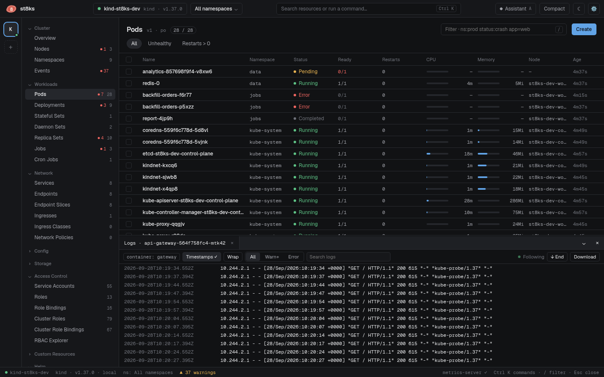

# Logs, shells and port-forwards

Logs and shells open in the dock at the bottom of the window. Each one is a tab. Drag the top edge of the dock to change its height. **⌄** minimizes the dock, and **✕** closes all tabs.



## Logs

Open logs in one of these ways:

- Press `l` in the detail panel of a pod.
- Click **Logs** in the detail panel, or **Logs** on a container.
- Select pods in the list and click **Logs** in the bulk bar.
- Press `Ctrl K` and type `logs: ` and the pod name.

The log view first loads the last lines of the container, 5000 by default. Then it follows new lines. Change the number in Settings > Logs.

| Control | What it does |
| --- | --- |
| Container | Selects the container in a pod with more than one container. |
| **Previous container** | Shows the log of the container before its last restart. This is the log that explains a crash. |
| **Timestamps** | Shows the time of each line. |
| **Wrap** | Wraps long lines. |
| **All**, **Warn+**, **Error** | Shows only lines at or above that level. |
| Search | Shows only lines that contain the text, and highlights it. |
| **↓ End** | Scrolls to the newest line and follows again. |
| **Download** | Saves the complete log of the container to a file. |

The level comes from the text of each line: `ERROR`, `WARN`, `INFO` and `DEBUG` words, `level=` fields and JSON `"level"` fields.

When the container restarts, the view waits for the new container and continues with its log. When a container stops for good, the stream ends.

The view keeps the newest 100,000 lines and renders only the visible lines.

## Shell

Open a shell in one of these ways:

- Press `s` in the detail panel of a pod.
- Click **Shell** in the detail panel, or **Shell** on a container.
- Press `Ctrl K` and type `shell: ` and the pod name.

st8ks starts `bash` when the image has it, then `ash`, then `sh`. The terminal is a full TTY. Colors, `vim`, `top` and resizing work.

### Debug container

A container that does not run has no shell. Distroless images have no shell either. For these, the shell tab offers **Start debug container**:

1. Keep `busybox:1.36`, or type another image.
2. Click **Start debug container**.

st8ks adds an ephemeral container that shares the process namespace of the target container, and attaches to it. This is the same as:

```sh
kubectl debug -it POD --image=busybox:1.36 --target=CONTAINER
```

Ephemeral containers stay in the pod spec until the pod is deleted.

## Port-forwards

Each container port in the pod overview has a **Forward :PORT** button. st8ks listens on `127.0.0.1` with the same port number when it is free, and on a random port when it is not. A notice shows the local port.

The status bar shows the number of running port-forwards. Click it to open a port in the browser, stop one port-forward, or stop all of them. Port-forwards keep running when you switch context.

st8ks uses WebSocket streaming for exec and port-forward, and falls back to SPDY for API servers that do not support it.
