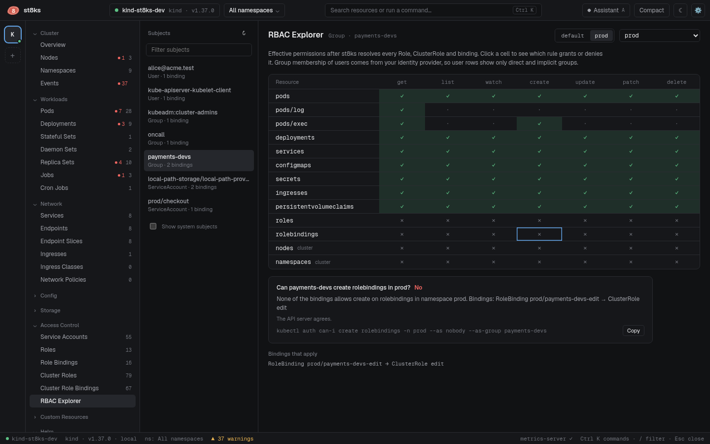

# RBAC explorer

The RBAC explorer shows what a user, group or service account can do in a namespace, and which rule allows or denies it. Open it from **Access Control > RBAC Explorer**.



## Read the matrix

1. Select a subject on the left. The list contains every subject that a RoleBinding or ClusterRoleBinding names. System subjects are hidden until you check **Show system subjects**.
2. Select a namespace at the top right.
3. Read the matrix. Each row is a resource and each column is a verb.

| Cell | Meaning |
| --- | --- |
| ✓ | Allowed |
| ◐ | Allowed only for named objects, through `resourceNames` |
| ✕ | Denied |
| · | The verb does not apply, for example `list` on `pods/log` |

Rows marked **cluster** are cluster-scoped resources. Only ClusterRoleBindings grant them.

## Find out why

Click a cell. The explanation names the binding, the role and the rule:

> RoleBinding prod/payments-devs-edit → ClusterRole edit allows delete on pods

For a denied cell, it lists the bindings that apply and says that none of them allows the verb.

Below the explanation, st8ks shows the result of a SubjectAccessReview. The API server answers it with all its authorizers, not only RBAC. "The API server agrees" confirms the answer. When a webhook or another authorizer decides differently, the line says so.

The last line is the matching `kubectl` command, for example:

```sh
kubectl auth can-i create rolebindings -n prod --as nobody --as-group payments-devs
```

## How st8ks resolves permissions

st8ks evaluates the RBAC rules locally, from the Roles, ClusterRoles and bindings in its watch cache:

- A subject matches a binding directly, or through the implicit groups `system:authenticated`, `system:serviceaccounts` and `system:serviceaccounts:NAMESPACE`.
- A rule matches when its API groups, resources and verbs match, with `*` as a wildcard. `pods` does not grant `pods/log`. `*/log` does.
- Aggregated ClusterRoles use the rules that the controller aggregated into them.

Group membership of users comes from your identity provider, not from the cluster. For a user, the matrix shows only the permissions of the user and of the implicit groups. Select the group to see its permissions.
