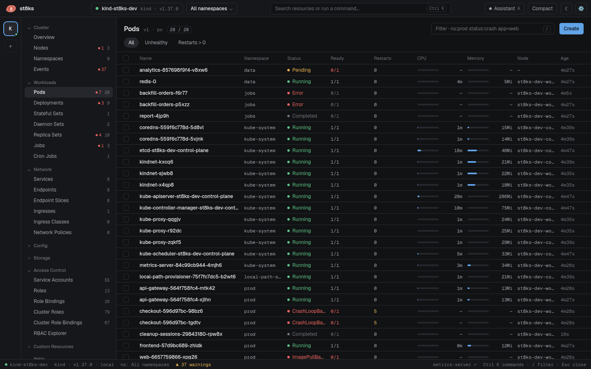

# Resources, filters and bulk actions

## The tree

The tree lists every kind that the cluster serves, in the groups Cluster, Workloads, Network, Config, Storage, Access Control, Custom Resources, Helm and Views. Kinds that the API server does not serve do not show. Click a group title to collapse it. st8ks remembers the state.

- The grey number is the number of objects in the selected namespaces.
- The red number is the number of objects that need attention. An object needs attention when a status or ready column is in a warning or error state.

**Custom Resources** lists **Definitions** and one entry for each CustomResourceDefinition. The columns come from the `additionalPrinterColumns` of the CRD. The list of a custom kind starts to load when you open it.

## Namespaces

The namespace menu in the top bar selects one namespace, several namespaces, or all of them. Type in the menu to filter. The selection applies to lists, counts, events, issues and the topology. st8ks remembers the selection for each context.

## Filter a list

Press `/` to focus the filter box. Space separates terms, and all terms must match.

| Term | Matches |
| --- | --- |
| `checkout` | Any cell, the name, the namespace or a label that contains `checkout` |
| `ns:prod` | Objects in a namespace that contains `prod` |
| `status:crash` | Rows whose Status column contains `crash` |
| `node:worker-2` | Rows whose Node column contains `worker-2` |
| `name:api` | Objects whose name contains `api` |
| `app=web` | Objects with the label `app=web` |
| `label:tier` | Objects with a label that contains `tier` |
| `-kube-system` | Objects that do not match `kube-system` |

Any column works with `column:value`. For example, `type:loadbalancer` filters the Type column of Services, and `restarts:5` filters the Restarts column of Pods. The match ignores case and spaces in the column name.

Press `Esc` to clear the filter. Press `Enter` or `↓` to move to the list.

## Saved views

The pills above the list are views:

- **All** shows every object.
- **Unhealthy** shows the objects that need attention.
- **Restarts > 0** shows pods with at least one restart.

To save your own view, type a filter and click **+ Save "…" as view**. The view is stored per kind. Click **✕** on a view to remove it.

## Sort

Click a column header to sort. Click again to reverse the order, and a third time to go back to the default order by namespace and name. Names sort in natural order, so `pod-2` comes before `pod-10`. CPU and memory columns sort by live use.

## Select and act on many objects

Click the check box of a row, or press `x` on the row under the cursor. The header check box selects all visible rows. A bar appears at the bottom:

| Action | Kinds | What it does |
| --- | --- | --- |
| **Logs** | Pods | Opens the logs of up to six pods in the dock |
| **Restart** | Deployments, StatefulSets, DaemonSets | Rolling restart, like `kubectl rollout restart` |
| **Copy names** | All | Copies the names, one per line |
| **Delete…** | All | Deletes the objects after a confirmation |

## Create an object

Click **Create**. The YAML editor opens with a template for the kind in the first selected namespace. Edit it, click **Server dry-run** to validate it, then click **Create**. A document with more than one object, separated by `---`, creates each object.

## Live updates

Lists update while you watch. Rows change in place without a reload, and the age column counts up. See [Architecture](architecture.md) for how st8ks keeps large lists fast.

ConfigMaps and Secrets load only their names until you open their list. Secret values never stay in memory. The list shows the type and the number of keys, and the YAML tab loads the values on demand.
