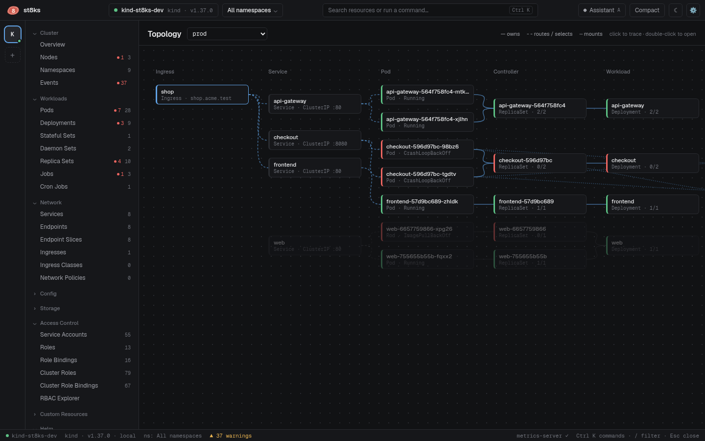

# Topology

The topology view draws the objects of one namespace and how they connect. Open it from **Views > Topology**.

## Columns

| Column | Objects |
| --- | --- |
| Ingress | Ingresses |
| Service | Services |
| Pod | Pods that did not finish |
| Controller | ReplicaSets and Jobs |
| Workload | Deployments, StatefulSets, DaemonSets and CronJobs |
| Config & storage | ConfigMaps, Secrets and PersistentVolumeClaims that pods use |

The color on the left edge of a box shows the status. Red is an error, yellow is a warning and green is healthy.

## Lines

| Line | Meaning |
| --- | --- |
| Solid | Owns, for example a ReplicaSet owns a pod |
| Dashed | Routes or selects, for example an ingress routes to a service, and a service selects a pod |
| Dotted | Uses, for example a pod mounts a ConfigMap |

## Trace a path

Click a box. st8ks highlights the chain through that box in both directions and dims everything else. Click the ingress `shop` to see every service, pod, ReplicaSet and Deployment behind it. Click the background to clear the trace.

Double-click a box to open the object in the detail panel.

## Namespace

The view shows the namespace in the selector at the top. When you select exactly one namespace in the top bar, the view uses it. Otherwise it starts with the namespace that has ingresses and the most pods, and skips system namespaces.

The view refreshes every 5 seconds. It shows at most 300 pods. A notice appears when a namespace has more.
